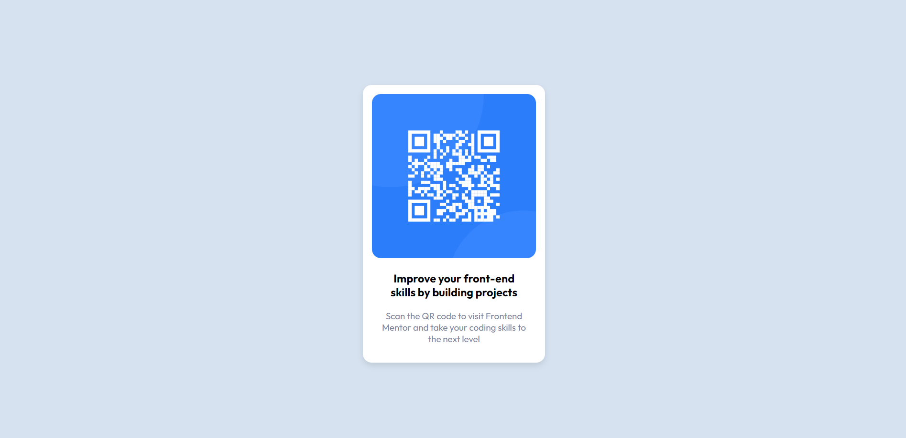

# Front-end Style Guide

## Github Pages & Angular

It was kinda tricky to start a live site with Angular and github.
the solution was Angular CLI gh-pages.

$ng build --configuration production --base-href "https://username.github.io/reponame/" --deploy-url "https://username.github.io/reponame/"
$npx angular-cli-ghpages --dir=dist/Project-name

## Layout

The designs were created to the following widths:

- Mobile: 375px
- Desktop: 1440px

## Colors

- White: hsl(0, 0%, 100%)
- Light gray: hsl(212, 45%, 89%)
- Grayish blue: hsl(220, 15%, 55%)
- Dark blue: hsl(218, 44%, 22%)

# Frontend Mentor - QR code component solution

This is a solution to the [QR code component challenge on Frontend Mentor](https://www.frontendmentor.io/challenges/qr-code-component-iux_sIO_H). Frontend Mentor challenges help you improve your coding skills by building realistic projects.

## Screenshot

Design given by FrontendMentor

Screenshot from the solution

## Built with

- Semantic HTML5 markup
- CSS custom properties
- Flexbox
- [Angular](https://angular.io/)

## Author

- Frontend Mentor - [@fynr80](https://www.frontendmentor.io/profile/fynr80)
- Twitter - [@fynr80](https://github.com/fynr80)
